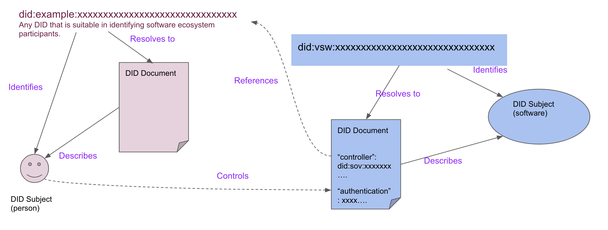
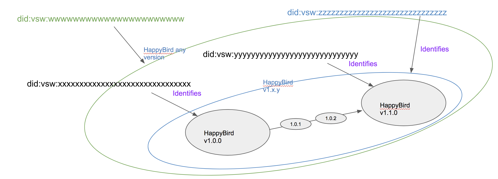

# Introduction
For **vsw** v1, our implementation relies on [ACA-py agent](https://github.com/hyperledger/aries-cloudagent-python)
which currently does not support cross ledger. In this specification, we design an approach that can be implemented
leveraging the existing verifiable credential registry Sovrin network.

Sovrin network consists of 3 instances of networks running in Indy Node.
 - BuilderNet: for developerment testing (aka Sandbox)
 - StagingNet: for deployment testing (aka POC)
 - MainNet: for operational deployment
 
Our development work can use the two testing networks.

# vsw v1 DID and Credential Features
Most of the existing DID methods identify an actor who can exercise control in an ecosystem (being **active**),
for example a human or a human organization or an automated system. In **vsw**, we need a new type of DID that identifies a
passive object (i.e. a unit of software) that is controlled by an active DID. Software also has
unique challenges in identifying various degree of specificity and complex dependencies to meet dynamic needs that emerge in
modern software ecosystems.

## DIDs used in vsw
**vsw** v1 uses 2 types of DIDs. One is to identify an active participant in the **vsw** ecosystem, e.g. a developer,
a tester, an auditor, and so on. The other type is to identify a unit of software, which we describe in more detail
below. For both types, we use **did:sov** which is implemented using Indy Node and is compatible with ACA.py agent.

For the DIDs representing participants, there are two sub-types:
 - Public (write) DIDs: for participants who can issue credentials (write to the ledger)
 - Peer DIDs: those who do not need to issue credentials by their own DIDs.

To support these 2 types, we will need to design and publish 2 DID schemas. The design of these schemas is **to follow*.

## Authenticated Controllers
Knowing who developed a piece of software is a critical factor for users to decide whether or how much
to trust this software. In **vsw**, this is represented by the Controller of the vsw DID. This entity (person
or organization or automated system) is identified by the participant DID. The **software**, in contrast,
is identified by a **passive** DID. These concepts are further discussed in the [Proposed DID Core Appendix](https://github.com/w3c/did-core/issues/373).
In the diagram below, we illustrate graphically the controller relationship.

.

## Semantic Versioning
**vsw** is designed to enable developers and other parties to publish verifiable credentials about a unit of software.
The prerequisite of achieving this is to have a DID uniquely identifying the given unit of software. In common
software development practice, the concept of a unit of software is often fluent and vague, however,
with various degree of specificity. For example, when a child says, "I love to play HappyBird.", she is refering
generally about the App named "HappyBird". While a software tester says, "HappyBird 1.0.1 build
is broken", she is refering to a specific version's the software bearing the name "HappyBird".
We need to design the **software DID** to accomodate these kinds of variants. Specifically, we are to support
the Semantic Versioning functions as defined by [SemVer](https://semver.org).
In the diagram below, we illustrate graphically the semantic versioning relationship.

.

### Sub-Versioning
Semantic Versioning uses X.Y.Z format, where X is a Major release, Y is a Minor release and Z is a Patch release.
Developers may choose to allocate a **software DID** for each Minor release and Major release as shown in the above
example (or a different variation). A need arises when a user likes to download a specific patch release, e.g. 1.0.1,
which does not have its own DID. In such cases, the patch versions must be listed in the parent DID Document with a series of
cryptographic hashlinks (see next section) which can be dereferenced using DID URL. This scheme implies that the DID Document
will be updated every time that a new patch is produced. 

**Implementation note**: I'm not certain if ACA-py or Indy Node currently supports DID URL dereferencing. If not, then the
above procedure can be implemented by first DID resolution (locating the DID Document), then parse the DID Document to
locate the field which contains the list of patches.

### LATEST
This above design also supports other naming of versions, e.g. LATEST can also be expressed with DID URL path.
LATEST is defined as the last patch in the DID Document's patch list. The concept of LATEST is fined to the
current minor or major release that the DID identifies. In other words, it does not go up to a parent (see below).

### Predecessor, Successor and Parent
A user (consumer of software) who knows the DID of HappyBird 1.1 may want to find out information about its
predecessor HappyBird 1.0. [SemVer](https://semver.org) defines predecessor ordering. Similarly, one may want to
know the successor version of the software identified by the DID, which is HappyBird 1.2.

**vsw** also defines superset (**parent**) relationship. For example, HappyBird 1.1.0's **parent** is *HappyBird 1*, whose
**parent** is in turn *HappyBird*.

## Cryptographic Hashlink
In traditional software distribution systems, the software image and its SHA integrity check are often separate.
It therefore leaves a gap where the hosting system could make changes without the users noticing. A cryptographic hashlink
is designed close this gap and, at the same time, allow flexibility in repository systems where the software image is hosted. 
The hashlink can be a field in the DID document and a hashlink in the DID URL. Dereferencing operation of this DID URL
is successful only if the referenced file produces an identical hash. With a cryptographic hashlink, a user will know if
a file has been changed either intentionally or accidentally, or maliciously (e.g. by an attacker).
In the diagram below, we show an example of **hl** hashlink that, when dereferenced, returns unchanged software image.
For details of hashlink, please refer to this [IETF Draft](https://tools.ietf.org/html/draft-sporny-hashlink-05).

.

Hashlink and hashlink dereferencing does not involve DID resoltion, so this feature can be implemented in **vsw** on
top of the **did:sov** method without causing issues.

# vsw Schemas

## vsw Participant Credential Schema
We need to be able to issue credentials to participants. This schema is to define data fields for the type of credentials
that can adequately identify a developer, tester, auditor etc. For example, name, address, and some contact information
such as email address. 

## vsw Software Credential Schema
We do need to define a schema that supports the **vsw** features defined above.

## vsw Software Test Credential Schema
We also need to define a schema that supports software test credentials.

## Publish Schema
The **vsw-repo** acts on behalf of the ecosystem to define and publish schema, as defined above. In Sovrin network,
publishing a schema costs $50 one time fee. 

# vsw Credentials

## Issuer DID (aka Write DID)
In **vsw** v1, the **vsw-repo** is an issuer of credentials. Other
participants may become an issuer themselves or delegate the issuance to **vsw-repo**.

To become an issuer of software credentials, the participant must register a public DID (in Sovrin ledger). 
We envision that the company (or the department within that company) who develops HappyBird would have one
such public DID. In Sovrin network, this DID costs $10 and every rotation of the keys costs another $10. This fee
reflects the cost of all future verification of identify related to this issuer. 

For participants who do not wish to or need to be a verified issuer, in **vsw**, the vsw-repo can represent
the common or the delegated issuer on behalf of these participants. These participants already have a peer DID and
has been issued a participant credential which they can use to sign the claims. The vsw-repo can issue the
software credential with a field that states who is the origin of the claims.

The choice of using one's own issuer DID or the common DID should be enabled by an option in the **vsw register**
command.

## vsw Credential Definition
Before issuing credentials, an issuer must first define credentials using pre-defined schemas, In simple cases, a credential
definition only uses claims from a single Schema, but it could also combine claims from multiple schemas.

For the common default issuer **vsw-repo**, it needs to
  - define a participant credential which the vsw-repo will administer during **vsw register**
  - define a software credential (or software publish claims), see **vsw publish**
  - define a software test credential (or software attest claims), see **vsw attest**
  - others TBD

All participants who are also issuers have similar requirements to define all credentials they wish to issue individually.
For example, a developer will need to define a software credential. A tester will need to define a test result credential.
**note**: to confirm.

This option should also be implemented in **vsw register** command as a subcommand.

## vsw Credential Issuance
With the credential definitions written to the Sovrin network, an issuer can start issue credentials. This is done by
 - **vsw register** for participants
 - **vsw publish** for software by the developers
 - **vsw attest** for software by the testers/others
 
 Additional types of credentials are TBD.
 
## vsw Credential Revocation
TBD

# References
