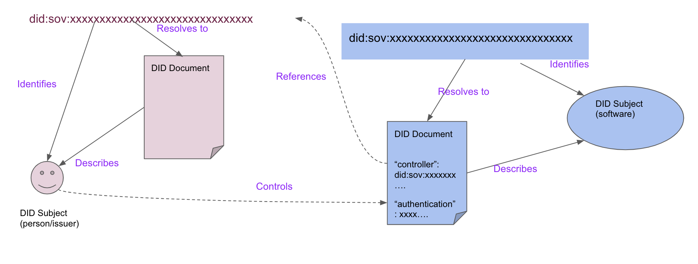
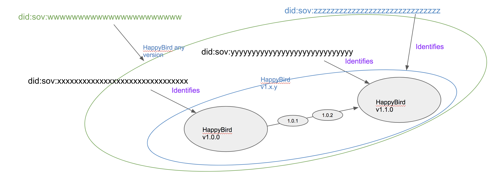

# Introduction
For **vsw** v1, our implementation relies on [ACA-py agent](https://github.com/hyperledger/aries-cloudagent-python)
which currently does not support cross ledger. In this specification, we design an approach that can be implemented
leveraging the existing verifiable credential registry [Sovrin network](https://sovrin.org/developers/), the ACA-py agent
and the [Indy SDK](https://github.com/hyperledger/indy-sdk) on which the agent implementation is based on.

Sovrin network consists of 3 instances of networks running in Indy Node.
 - BuilderNet: for development testing (aka Sandbox)
 - StagingNet: for deployment testing (aka POC)
 - MainNet: for operational deployment
 
Our development work can use the two testing networks, using the BuilderNet for development and the StagingNet for
Proof of Concept deployment.

Sovrin networks are no longer using token payments. We will not use any token payment capabilities in **vsw**. All ledger
transactions will be done through **endorsers** (aka **Trust Anchors**). More in the next section on this point.

# vsw v1 DID and Verifiable Credential Features
Most of the existing DID methods identify an actor who can exercise control in an ecosystem (being **active**),
for example a human or a human organization or an automated system. In **vsw**, we also need another type of DID that identifies a
passive object (i.e. a unit of software) that is **controlled by an active DID**. Software also has
unique challenges in identifying various degree of specificity and complex dependencies to meet dynamic needs that emerge in
modern software ecosystems.

## DIDs used in vsw
**vsw** v1 uses various types of DIDs. One is to identify an active participant in the **vsw** ecosystem, e.g. a developer,
a tester, an auditor, and so on. The other type is to identify a unit of software, which we describe in more detail
below. For both types, we use **did:sov** which is implemented using Indy Node and is compatible with ACA.py agent which
uses Indy SDK to interact with an Indy Node based network.

For the DIDs representing participants who issue credentials, they need Public DIDs (aka Write DIDs) to write to the ledger.
For example, suppose a company Happy Software, Inc. publishes a game HappyBird. The company will need a public DID to issue
credentials about the software HappyBird. Suppose an independent testing organization Games Unlimited wants to publish its
evaluation of HappyBird, it will also be issuing credentials and need a public DID. General game players will not need a public
DID as they only verify credentials presented by the registry.

In current Sovrin operated networks, this role can be realized as an endorser (previously called a trust anchor). In this
design, we will use a DID that is an endorser for any role that issues credentials or writes to the ledger. A non-endorser (aka non-priviledge)
can still prepare a transaction then ask an endorser to write the transaction to the ledger while preserving its authorship.
A non-endorser still has its own DID, but its DID cannot write to the ledger.

In the ACA-py agent, Peer DIDs are used for establishing peer-wise messaging communication using DIDComm. These are between
the agents of different participants, e.g. between the software developer and the **vsw-repo**, or between the **vsw-repo**
and the software consumer. Peer DIDs are automatically generated and do not show up in the ledger.

Ordinary consumers of software, e.g. the game players, do not need a public DID if they are not going to issue any credentials.
In summary:
 - vsw-repo: an endorser DID, defines schemas, endorses credential definitions
 - a software developer: a non-endorser DID, whose credential definition is endorsed by vsw-repo, or becomes an endorser itself
 - a software tester: same as a developer
 - a software consumer: no DID required.

As a general rule, we suppose all users of **vsw** to have their DIDs, either as an endorser or as a Null role (non-privileged). 

Note any entity could play more than one roles at the same time.

To uniquely identify a unit of software, the developer will allocate a non-privileged DID for the software, then issue
credentials for that DID. 

## vsw Repository Roles
The **vsw** repository plays multiple roles. It is important that we differentiate these roles. The most important role
it plays is as the **holder** of verifiable credentials issued. As a holder, it can interact with a consumer answering his/her
proof request with a presentation of proof. The consumer can accept the proof as if it is from the issuer (**transitive trust**).
In this role, the **vsw** repository is a convenient digital **registry** where consumers can request for verifiable information.
Note that the role of a verifiable credential registry does not imply a "centralized" authority because the trust rests with
the issuers, not the holder. And the same credentials can be issued to another registry by the issuers.

In earlier discussions, we thought there might be a need for some users not having any unique DID (other than the peer DID).
In such circumstances, the **vsw-repo** might play the role of a proxy to issue credentials on behalf of these users.
There is some uncertainty if that is needed. Until further clarification, we would suppose there is no such need. So consider
this role as TBD.

Finally, **vsw** may also serve as the storage system for the published software where consumers can verify its credentials
as well as downloading safely using hashlink to ensure its integrity. This role can be played by other storage systems as
well.

## Authenticated Controllers
Knowing who developed a piece of software is a critical factor for users to decide whether or how much
to trust this software. In **vsw**, this is represented by the **Controller** of the software's DID. This entity (person
or organization or automated system) is identified by the active participant DID. The **software**, in contrast,
is identified by a **passive** DID. These concepts are further discussed in the [Proposed DID Core Appendix](https://github.com/w3c/did-core/issues/373).
In the diagram below, we illustrate graphically the controller relationship.

.

(**Note**: needs clarification on how to set Controller DID in Indy SDK and in ACA-py.)

## Semantic Versioning
**vsw** is designed to enable developers and other parties to publish verifiable credentials about a unit of software.
The prerequisite of achieving this is to have a DID uniquely identifying the given unit of software. In common
software development practice, the concept of a unit of software is often fluent and vague, however,
with various degree of specificity. For example, when a child says, "I love to play HappyBird.", she is refering
generally about the App named "HappyBird". While a software tester says, "HappyBird 1.0.1 build
is broken", she is refering to a specific version's the software bearing the name "HappyBird".
We need to design the **software DID** to accomodate these kinds of variants. Specifically, we are to support
the Semantic Versioning functions as defined by [SemVer](https://semver.org).
In the diagram below, we illustrate graphically the semantic versioning relationship.

.

### Sub-Versioning
Semantic Versioning uses X.Y.Z format, where X is a Major release, Y is a Minor release and Z is a Patch release.
Developers may choose to allocate a **software DID** for each Minor release and Major release as shown in the above
example (or a different variation). A need arises when a user likes to download a specific patch release, e.g. 1.0.1,
which does not have its own DID. In such cases, the patch versions must be listed in the parent DID Document with a series of
cryptographic hashlinks (see next section) which can be dereferenced using DID URL. This scheme implies that the DID Document
will be updated every time that a new patch is produced. 

**Implementation note**: I'm not certain if ACA-py or Indy Node currently supports DID URL dereferencing. If not, then the
above procedure can be implemented by first DID resolution (locating the DID Document), then parse the DID Document to
locate the field which contains the list of patches.

### LATEST
This above design also supports other naming of versions, e.g. LATEST can also be expressed with DID URL path.
LATEST is defined as the last patch in the DID Document's patch list. The concept of LATEST is fined to the
current minor or major release that the DID identifies. In other words, it does not go up to a parent (see below).

### Predecessor, Successor and Parent
A user (consumer of software) who knows the DID of HappyBird 1.1 may want to find out information about its
predecessor HappyBird 1.0. [SemVer](https://semver.org) defines predecessor ordering. Similarly, one may want to
know the successor version of the software identified by the DID, which is HappyBird 1.2.

**vsw** also defines superset (**parent**) relationship. For example, HappyBird 1.1.0's **parent** is *HappyBird 1*, whose
**parent** is in turn *HappyBird*.

## Cryptographic Hashlink
In traditional software distribution systems, the software image and its SHA integrity check are often separate.
It therefore leaves a gap where the hosting system could make changes without the users noticing. A cryptographic hashlink
is designed close this gap and, at the same time, allow flexibility in repository systems where the software image is hosted. 
The hashlink can be a field in the DID document and a hashlink in the DID URL. Dereferencing operation of this DID URL
is successful only if the referenced file produces an identical hash. With a cryptographic hashlink, a user will know if
a file has been changed either intentionally or accidentally, or maliciously (e.g. by an attacker).
In the diagram below, we show an example of **hl** hashlink that, when dereferenced, returns unchanged software image.
For details of hashlink, please refer to this [IETF Draft](https://tools.ietf.org/html/draft-sporny-hashlink-05).

.

Hashlink and hashlink dereferencing does not involve DID resoltion, so this feature can be implemented in **vsw** on
top of the **did:sov** method without causing issues.

# vsw Schemas

## vsw Participant Credential Schemas
**vsw** **MAY** need to be able to issue credentials to participants. These schemas are to define data fields for the type of credentials
that can adequately identify a developer, tester, auditor etc. to facilitate trusted exchange. There may be more than one such schemas
as needs arise.

For every adopted schema, the **vsw-repo** writes a credential definition using its public DID to the ledger. For the minimum,
the **vsw-repo** issues a simple credential to identify any user as a registered user of **vsw** during **vsw register**.

## vsw Software Credential Schema
We do need to define a schema that supports the **vsw** features defined above.
See Issue [#4](https://github.com/verifiablesoftware/vsw/issues/4).
**vsw-repo** publishes at least one software credential schema (and multiples eventually) to the ledger using its public DID.
Other developers may publish their own credential schemas as well, but standard **vsw** features require the standard schemas published
by **vsw-repo**.

## vsw Software Test Credential Schema
We also need to define a schema that supports software test credentials.
See Issue [#40](https://github.com/verifiablesoftware/vsw/issues/40)
**vsw-repo** publishes at least one software credential schema (and multiples eventually) to the ledger using its public DID.
Other testers may publish their own credential schemas as well, but standard **vsw** features require the standard schemas published
by **vsw-repo**.

## Publish Schema
The **vsw-repo** acts on behalf of the ecosystem to define and publish schemas, as defined above.  
Others can define and publish additional schemas as well. This is typically done as a common act of the ecosystem, so it's a good
practice for **vsw-repo** to publish standard ones, or some consensus adoption mechanism to come to a common set of schemas. For **v1**,
we assume **vsw-repo** acts as the consensus.

# vsw Credentials

## Issuer DID (aka Write DID)
In **vsw** v1, there are many issuer of software credentials, e.g. developers, testers.

To become an issuer of software credentials, the participant must register a public DID. 
We envision that the company (or the department within that company) who develops HappyBird would have one
such public DID. (In the Sovrin mainnet, this DID costs $10 and every rotation of the keys costs another $10.)

~~For participants who do not wish to or do not need to be an issuer, in **vsw**, the vsw repository can proxy as a
common issuer on behalf of these participants. These participants already have a peer DID and may
have been issued a participant credential which they can use to prove their identify (i.e. the name and email address
information contained in the credential). The vsw-repo can issue the
software credential with a field that states who is the origin of the claims (i.e. the name and email address etc.)~~

~~The choice of using one's own issuer DID or the common proxy should be enabled by an option in the **vsw register**
command. Note that the default case is when one has a public DID to issue these credentials. If a participant chooses
to use the proxy, the credential will lose some trust level because the consumer must now trust the proxy. On the other
hand, in an open and transparent software ecosystem, the particpant can check the proxy's honesty by
verifying the credential he/she asks the proxy to issue.~~

## vsw Credential Definition
Before issuing credentials, an issuer must first define credentials using pre-defined schemas, In simple cases, a credential
definition only uses claims from a single Schema, but it could also combine claims from multiple schemas.

Each issuer has to do this step using their own public DID. In current Sovrin networks, only endorsers can do this step.
For non-privileged DIDs, prepare the transaction and ask an endorser (i.e. **vsw-repo**) to publish the credential definition.
They can then issue credentials.

For the common default issuer **vsw-repo**, it needs to
  - define a participant credential which the vsw-repo will administer during **vsw register**
  - define a software credential, see **vsw publish**
  - define a software test credential (or software attest claims), see **vsw attest**
  - others TBD

All participants who are also issuers have similar requirements to define all credentials they wish to issue individually.
For example, a developer will need to define a software credential. A tester will need to define a test result credential.
These definitions uses a schema and binds with the issuer's DID. They either become endorsers themselves or ask **vsw-repo**
to publish the definitions for them.

This option should also be implemented in **vsw register** command as a subcommand.

## vsw Credential Issuance
With the credential definitions written to the ledger, an issuer can start issue credentials. This is done by
 - **vsw register** for participants
 - **vsw publish** for software by the developers
 - **vsw attest** for software by the testers/others
 
 Additional types of credentials are TBD.
 
## vsw Credential Revocation
TBD

# References
